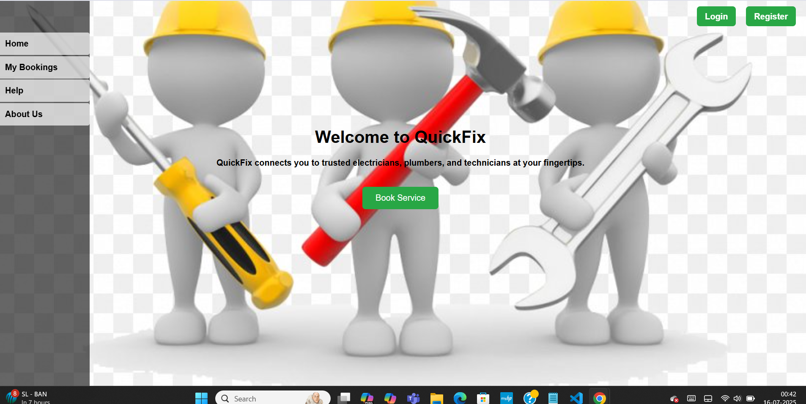

# 🔧 QuickFix – Repair Service Booking App

A full-stack web application to book electrician, plumbing, and repair services online.

---

## ✨ Features
- User registration and login
- Book repair services with details
- MySQL database integration
- Java Servlets for backend
- Clean and responsive UI
- Deployed with Apache Tomcat

---

## 🖼️ Screenshots

### ✅ Home Page

### 🧾 Booking Form

### 👨‍🔧 About Us Page

---

## ⚙️ Tech Stack

- Java (Servlets)
- HTML, CSS, JavaScript
- MySQL
- Apache Tomcat
- VS Code

---

## 🚀 How to Run

1. Import into VS Code
2. Setup MySQL using `schema.sql`
3. Deploy `webapp/` to Apache Tomcat
4. Open browser at:  http://localhost:8080/quickfix-project/
